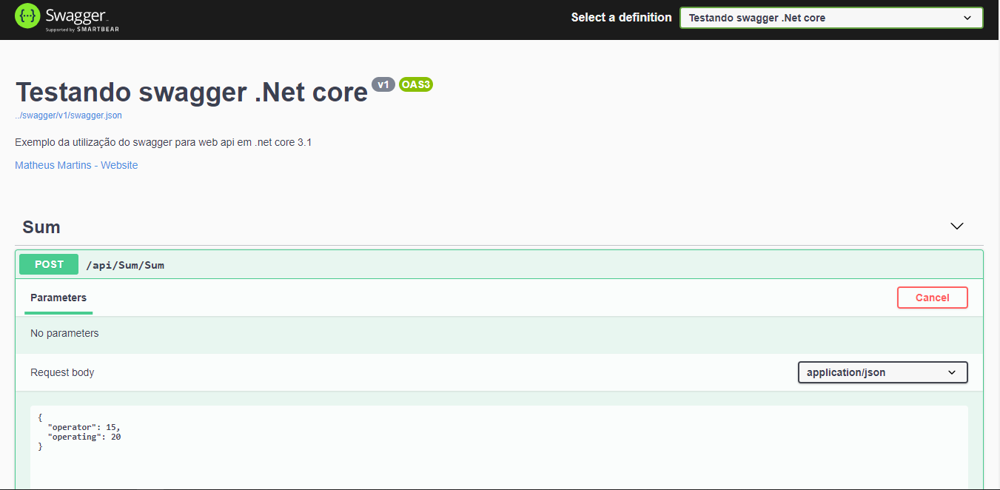
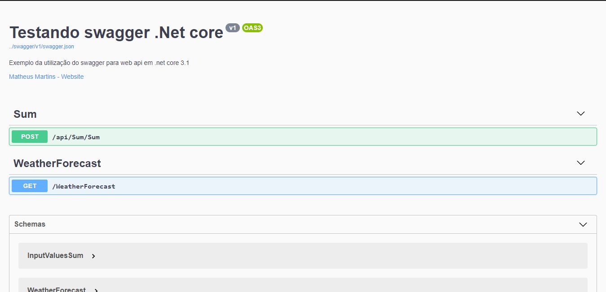

<h1 align="center" > WEB API COM SWAGGER </h1>

<h3>Tecnologias utilizadas neste projeto:</h3>
<ul>
<li>Swagger</li>
<li>.NET CORE 3.1</li>
</ul>

<h3>Ferramentas:</h3>
<ul>
<li>Postman</li>
<li>Visual Studio CODE</li>
</ul>

<h2>A idéia do projeto</h2>

O <strong>projeto</strong> é uma aplicação simples web pensado para demonstrar a simplicidade ao usar swagger para documentar
sua aplicação. Utilizei uma regra simples só para entermos o conceito, ele oferece uma interface prática e visualmente muito boa

<h3>Scripts úteis</h3>

Para iniciar o servidor: <code>dotnet run</code>

Abrir vs code executar debbug acesssar https://localhost:5001/swagger

<h1>Segue abaixo algumas imagens do projeto web:</h1>

| | 
|:-------------------------:|
| | 
| |
